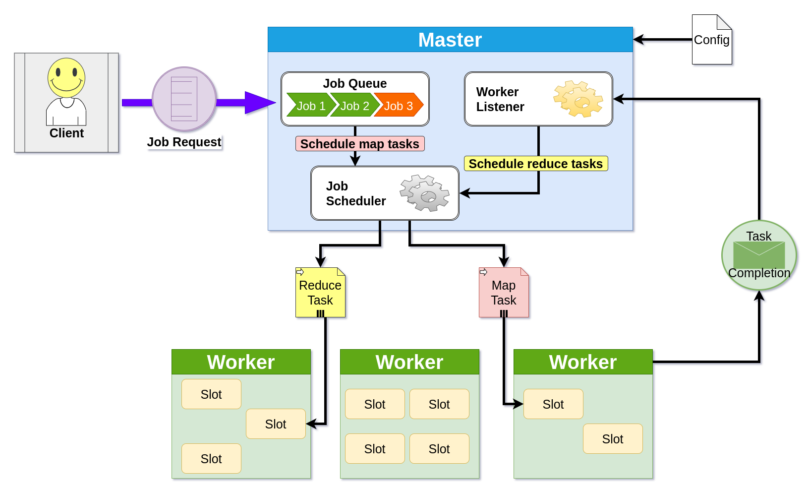
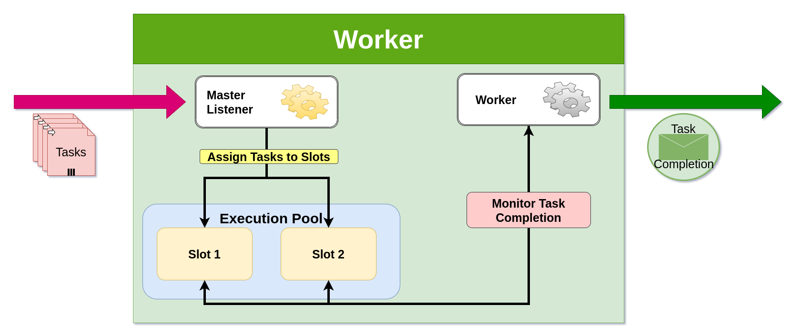
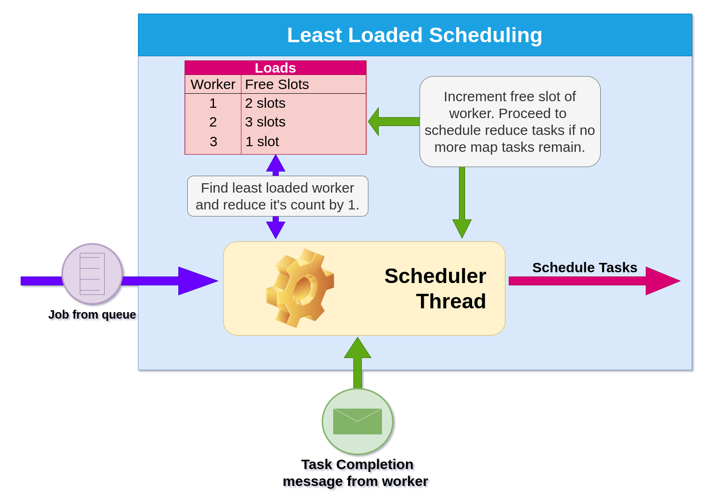
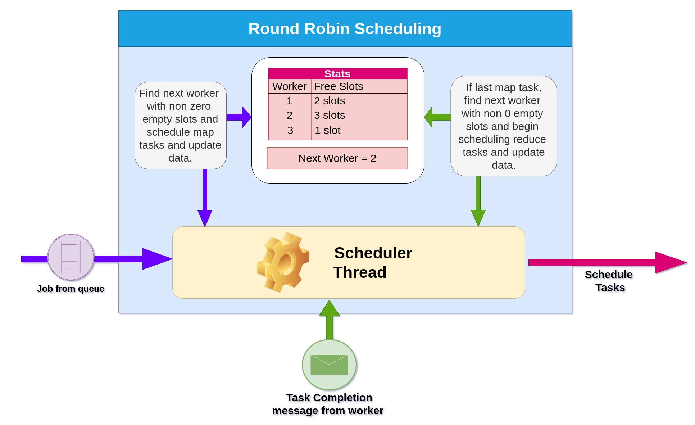
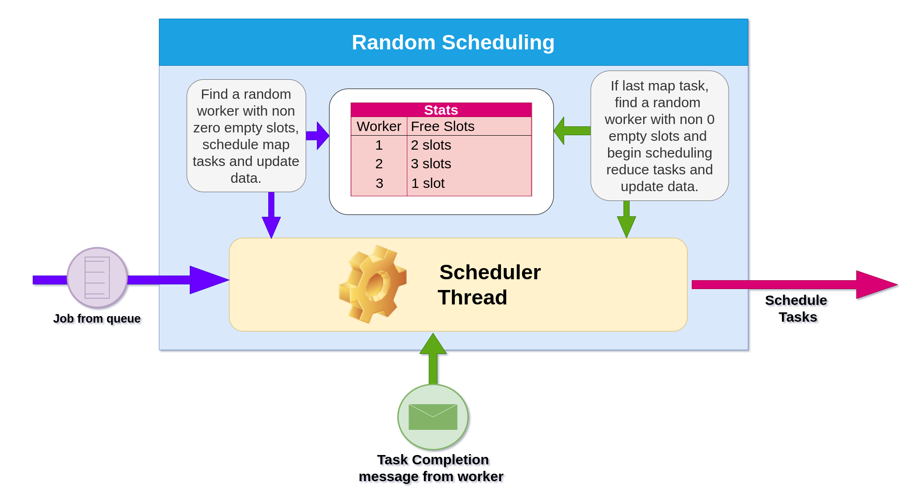

YACS
====

Yet Another Centralized Scheduler (YACS) is a scheduling framework that can schedule tasks using 3 different scheduling algorithms – random, round robin and least loaded. The framework has one master which manages the resources of the rest of the cluster which consists of worker machines. Each worker machine has a worker process and a fixed number of slots that execute tasks and send updates about the completion of the task to the master. The framework requires a configuration file which consists of the details of each of the worker machines that is required to form a connection from the master to the worker and also schedule tasks.

For this project, all the processes, i.e., master and worker processes run on the same machine. This behaves as a simulation of the working of YACS. It can also be used in a real distributed environment by providing each worker machine’s IP address in the configuration file.

Execution on a local machine
============================

First, clone the repository.

```
git clone https://github.com/Gituser143/YACS
```

On a shell navigate to `YACS/src/` and run the following command to spawn workers and the master.

```sh
cd YACS/src
python3 master.py config.json RR
```

To provide a custom configuration, replace `config.json` with the path to your custom config file.

To specify a different scheduling algorithm, replace `RR` with one of the following codes.

| Scheduling Algorithm | Code   |
|----------------------|--------|
| Round Robin          | RR     |
| Least Loaded         | LL     |
| Random               | RANDOM |

To generate job requests being sent to the master, we run `requests.py` following the number of jobs we want to send. We send 10 job requests below.

```sh
python3 requests.py 10
```

Architecture
============

The diagram below depicts the architecture of the application.



Master
------

The master process is a multithreaded process. There are 3 main threads running – client listener thread, worker listener thread and job scheduler thread. Functions of these threads are explained below:

-	**Client Listener**: This runs in the master process and listens for job requests sent by our "happy" client as depicted in the diagram above. On receiving the job request, it parses the request, and adds the job to the job queue.

-	**Job Scheduler**: This thread picks out jobs from the job queue and schedules the map tasks of the job. It uses the specified scheduling algorithm in the scheduling process and blocks scheduling if there are no empty slots available in the cluster. A helper function is used to schedule tasks of specified task type (map or reduce) from a job. This is done to maintain dependency integrity. Additionally, this scheduling helper function is invoked by the worker listener too, which is explained in the next point.

-	**Worker Listener**: This thread listens for responses from the master (task completions). This in turn creates multiple threads to accommodate parallel communications from various workers. On receiving updates, it updates all the concerned metadata on the master. Additionally, it performs a dependency check. The dependency check is such that if a map task is completed and is the last map task of a job, the reduce tasks of that job can now be scheduled. Thus, if the dependency check passes, the scheduling helper is invoked to schedule all reduce tasks of the given job.

In the case where the final reduce task of a job is completed, the job is then considered complete and metadata is updated accordingly.

Worker
------



Much like the master, the worker too is a multi-threaded process. As depicted from the image above, it has 2 main threads: Master listener and Worker. A key thing to note here, is that each sot is abstracted as a thread too. As tasks come in, these threads get to work by simulating the execution of the task for a specified duration. The functions of these threads in the worker are further explained below:

-	**Master Listener**: This thread constantly listens for tasks assigned to the worker by the master. On receiving a task, it schedules it on one of the slots (also threads) for execution.

-	**Slots**: These slots simulate the execution of a task for a specified duration. Once this execution has finished, task completion messages are sent to the master.

-	**Worker**: This thread keeps track of the threads running as slots. It ensures none of them end abruptly and on completion, clears these threads from the assigned slot.

For enhanced functionality, workers need not be spawned individually, when the configuration file is fed to the master. The master automatically spawns child processes as workers based on the configurations provided. In case of a distributed environment, instead of creating child processes, the master can spawn processes over the network using SSH (provided SSH functionality has been set up).

Schedulers
==========

Least Loaded Scheduler
----------------------



Here, the scheduler can get inputs from two places:

1.	The job queue scheduling all map tasks of a job.

2.	Response from worker, allowing reduce tasks to begin.

**Job scheduled from job queue**: In this case, no dependency check needs to be performed. All that is necessary, is for the scheduler to schedule all map tasks of a given job across the cluster. In order to do this, the scheduler iterates over available map tasks and finds the least loaded worker for each iteration and assigns the map task to that worker. After assigning a task, metadata is updated (free slots for workers).

**Job scheduled after response**: Here, a dependency check is performed by the worker listener before sending the reduce tasks to be scheduled. Scheduling is still done the same way as mentioned above. The only difference being, the scheduler now iterates over reduce tasks of a specified job rather than map tasks.

In the event where no slots are available when trying to schedule map tasks, scheduling is blocked till at least 1 empty slot exists.

Round Robin Scheduler
---------------------



Much like the least loaded scheduler, round robin too can receive tasks to be scheduled from the same two places, from the job queue and from the worker listener. The only difference would be in the mechanism of choosing a worker to assign the task to.

Unlike least loaded, round robin is not sensitive to the load of the worker. It keeps track of the previous worker a task was scheduled to and proceeds to schedule the current task to the next immediate worker. In the event of the current worker not having any free slots, the scheduler looks for the next immediate worker with empty slots and schedules them there.

In the event of no empty slots being available in the worker, scheduling is blocked until at least 1 free slot exists.

Random Scheduler
----------------



Much like the least loaded and round robin, random too can receive tasks to be scheduled from the same two places, from the job queue and from the worker listener. The only difference would be in the mechanism of choosing a worker to assign the task to.

In the case of random scheduling, a worker is picked at random and the given task is assigned to that worker. In case this worker has no empty slots, the random selection process is repeated but this time the worker selected previously is left out from the sample selection.

Similar to the above two scheduling algorithms, random too blocks scheduling in the event of no empty slots in the cluster.

Custom configurations
=====================

To make custom configurations for cluster, modify `config.json` to your liking. The format for the file must match the below mentioned.

```json
{
	"workers": [{
			"worker_id": "specified id as a number",
			"slots": "number of slots",
			"port": "port number the worker should listen on",
			"ip": "optional IP address of the worker (defaults to localhost)"
		},
		{
			"worker_id": 2,
			"slots": 7,
			"port": 4001,
			"ip": "localhost"
		},
		{
			"worker_id": 3,
			"slots": 3,
			"port": 4002
		}
	]
}
```

### NOTE: When attempting to run workers across different machines, the master's IP address must be set across workers.

Sending job requests
====================

Job requests can be sent without making use of `requests.py` too. To do so, a json of the specified format below must be sent through a TCP socket connection to port 5000 of the master's IP address.

Job request format:

```json
{
	"job_id": "0",
	"map_tasks": [{
			"task_id": "0_M0",
			"duration": 1
	}],
	"reduce_tasks": [{
		"task_id": "0_R0",
		"duration": 4
	}]
}
```
